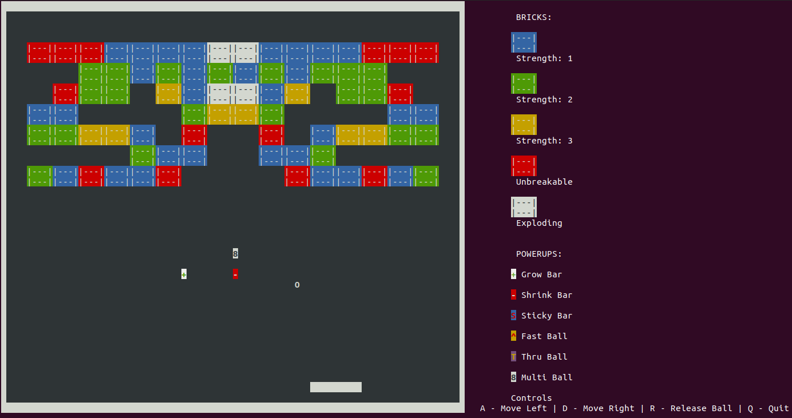
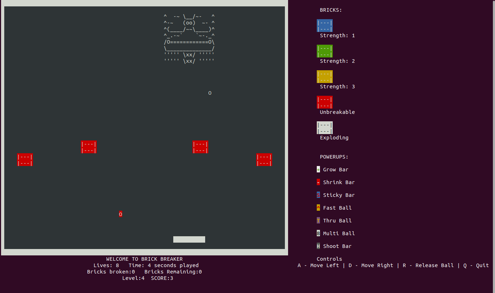
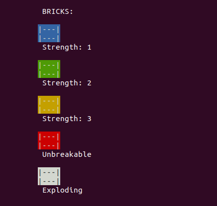
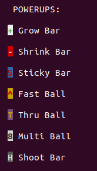
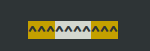

# Assignment 3 Readme

# DASS Assignment 3

### Extension of Terminal Based Brick Breaker in Python

In this assignment , an OOPS concept based terminal game in python was Built. The games is identical to the classic brick breaker game. The code of the game is written using various Python concepts including Inheritance , Polymorphism , Encapsulation and Abstraction. All the game objects and figures have been designed in ascii characters. The colors of the game are terminal colors used from Python's *colorama* module

# The Game (Extended features)

### Rules\Instructions

- The Player (Bar) has 8 lives
- There are 3 levels in the game and a Boss level at the end
- If all balls hit the bottom wall then a life is lost
- If the player is hit by the bomb of the UFO a life is lost
- The bar can move only in the boundaries of the game wall
- The paddle movement is controlled by A and D keys (left and right respectively)
- The ball when grabbed by the paddle , is released by the key 'r' or 'R'
- The game can be quit any time by pressing q or Q
- A level can be skipped using the 'x' or 'X' key
- On losing all lives , the game is lost and the game restarts
- After a certain amount of time - 45 seconds , the bricks begin to fall
- If the player touches the bricks the game is over
- On defeating the boss enemy , the game is won

### Guide
- Start up the game by running *python3 main.py*.
- Release the ball by pressing 'r' or 'R' on your keyboard
- Move the paddle left and righ using A and D keys
- Try to break the bricks without letting the ball touch the lower wall
- You have 8 lives to spare!
- Try to collect various powerups
- Try to aim for the exploding bricks to desroy multiple bricks at once (even unbreakable ones)
- A screenshot-

- At the boss level , try to hit the boss to decrease the health(12)

### Bricks and power-ups

### Bricks

There are **6** types of bricks in the game as follows: -

- Bricks strength 1 ,2 and 3

    These bricks take 1,2 or 3(Blue , Green , Yellow) hits respectively based on strength to destroy. Eg. 2 hits for Green brick

- Unbreakable Bricks

    These bricks **cannot** be broken by a normal ball hit. They **can only be broken using the Thru ball power-up or an exploding brick nearby**

- Exploding Bricks

    These explode on a single hit and **destroy** the bricks in a 3x3 area around them (horizontal , vertical and diagonal) If there are more exploding bricks near an exploding brick , then they explode in a chain reaction until the last brick connected has exploded

- Rainbow Bricks
These bricks keep on changing strengths from 1 ,2 , 3 until hit by the ball

### Power-Ups

There are **7** power-ups in the game : -

The power ups are either time additive or effect additive. Multiple powerups can be active at the same time and their effects/times of duration add up. The duration of powerups is 15 seconds

Effect Additive - Two powerups of this kind add up their effects. On expiring , these effects are reversed

Time additive - More powerups of this kind just increase the time duration of the power up as a whole. When all instances of it expire , only then is the effect gone

- Grow Bar (Effect additive)

    This power up makes the Bar **grow by 2 units when** when its applied. The reverse effect when it expires is shrink back 2 units. It has a green plus symbol on a white pixel

- Shrink Bar (Effect Additive)

    This power up makes the Bar **shrink by 2 units when** when its applied. The reverse effect when it expires is grow back 2 units. It has a white minus sign on a red pixel

- Sticky Bar (Time additive)

    This makes the Bar able to grab the ball on contact during its duration. It is indicated by the bar turning blue. The ball then has to be released by pressing R

- Fast Ball (Effect additive)

    This increases the speed of the ball by **increasing velocity in y direction by 2 units**. Its reverse effect on going is decrease back 2 units of y velocity. It is a yellow pixel with a red arrow

- Thru Ball ( Time additive)

    This power up makes the ball a 'Thru Ball'. This now enables the **ball to pass through and destroy any brick in its path , including unbreakable ones**. It is indicated by the ball turning yellow. It is a 'T' symbol on a purple pixel

- Multi Ball ( Effect Additive)

    This effect makes **each ball spawn out another ball. It has no effect on expiring.** The other balls can now only disappear if they hit the bottom wall/ It is denoted by an '8' symbol

- Shoot Bar
    This effects makes a **cannon appear on the paddle** and allows it to shoot bullets every one second. It's symbol is an 'H'

# Objects/Classes

### Canvas Class

This class holds the 2D grid on which the entire game is printed. It is this class that contains the information about the game boundaries and creates the game_world instance

### Object Class

This class is a parent class to the objects in the game = Bar , Ball and Brick. It has the fields - x coordinate , y coordinate , width and height

### Bar

A child of the object class. It represents the Bar(Player). A white rectangle with a default width of 10 units and height 1 unit. 

The Physics of The Bar

The following image shows the bar physics (Actual Bar is white). The further away the ball is in the yellow regions , that much velocity is imparted in that x directions. The White part imparts no x velocity and just reflects. Eg. 2nd arrow on the right yellow region will do ball_x_velocity += 2

### Ball

A child of the object class. It represents a ball object in the game. It is given an **initial speed of (1,-1)** (negative is up). 

### Brick

A child of the object class. It has 5 strengths - 1 , 2 , 3 , -1(Unbreakable) , -2 (Exploding) with the colors Blue , Green , Yellow , Red and White respectively. On damaging the brick once , its strength reduces by one if it is breakable , it explodes if it is an exploding brick , destroying the bricks in a 3x3 area around it. (Max of 8 breaks around it). The brick layout is obtained from the brick_layout.txt file and is created at the start of the game

### Bullet
Child of the object class. Represents a bullet shot by the bar

### UFO
A class for the boss enemy UFO

### Bomb
A class for a bomb dropped by the UFO

### Powerup Classes:

Parent Class - Powerup()

GrowBar()

ShrinkBar()

StickyBar()

FastBall()

ThruBall()

MultiBall()

ShootBar()
 

## OOPS Concepts

### Encapsulation

The whole game has been coded using classes and objects

### Inheritance

Both Objects and powerups use inheritance. The Bar , Ball and Brick objects are all Child classes that derive their x coordinates , y coordinates , width and height properties from the parent Object class

Powerups have a parent class called Powerup which has basic properties/methods like the down movement , apply , remove , checking expiration shared by all child powerup classes

### Polymorphism

The child powerup classes *override* the apply() and remove() methods in their parent Powerup class. The Multiball() class however inherits its default remove() function from the parent class which is do nothing

### Abstraction

Functions like - move_balls() , check_and_update() , decrease_strength() etc,, that hide the fields from the end user

# Files/Strucutre

- main.py

    Contains main code for the while loop of the game.

- ball_file.py

    Contains the Ball class and all functions related to balls

- bar.py

    Contains the Bar class 

- brick.py

    Contains the Brick class and all functions related to a brick

- canvas.py

    Contains the canvas class

- global_var.py

    Contains constants like game boundaries , world width , powerup duration , brick layout etc..

- util.py

    Contains utility functions like set_canvas , clear() , make_bricks() , game startup , life_lost() etc..

- powerups.py

    Contains all powerup classes and functions related to powerups

- input.py

    Contains the Get input class and the function to take user input at a regular interval of        **0.55** seconds**

- bullet.py
    Contains the class for bullets and methods

- bomb.py
    Contains the class for a bomb and methods

- ufo.py
    Contains the UFO class

- levels - level designs
    - level1.txt
    - level2.txt
    - level3.txt

- ufo.txt
    ASCII UFO design

# How to run

- cd into the folder
- run "python3 main.py"